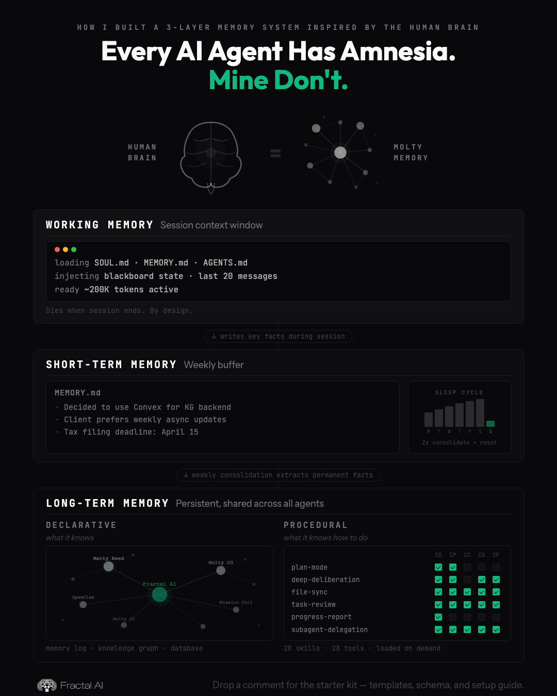

# Agent Memory Starter Kit

Give your AI agents memory that persists across sessions.

AI agents are strong at short-horizon reasoning but weak at continuity. Most systems restart from zero each session with no durable memory of previous decisions, learned context, or team state.

This starter kit provides a production-oriented memory architecture you can fork and adapt for your own multi-agent workflows.

## The Problem

AI agents start every session from zero. No memory of yesterday, last week's decisions, or accumulated knowledge.

Without memory, agents repeat mistakes, ask the same questions, and cannot build on prior work.

## The Architecture (3 Layers)

### Layer 1: Working Memory

All context available to the agent at session start and during execution:
- Agent files (`SOUL.md`, `AGENTS.md`, `TEAM.md`, `IDENTITY.md`, etc.)
- Blackboard state (tasks, messages, notifications)
- Current conversation context
- Tool outputs from the active session

Why: fastest access, zero retrieval latency, best for immediate reasoning and execution.

### Layer 2: Short-Term Memory (`MEMORY.md`)

A weekly rolling buffer (`<= 8KB`) that stores recent decisions, context, and unresolved questions.

Retrieval behavior:
- Read the entire file at session start.

Why `8KB`: small enough to inject every session without bloating tokens, large enough for one week of high-signal notes.

Why weekly reset: prevents stale context buildup and forces explicit consolidation into long-term systems.

### Layer 3: Long-Term Memory (persistent, shared across all agents)

Long-term memory splits into two categories:

#### Declarative — *what it knows*

Three complementary stores:

1. **Memory Log**
   - Dated markdown files (daily logs)
   - Retrieval: **semantic search** (embeddings)

2. **Knowledge Graph (KG)**
   - Durable entities and relationships (nodes/edges)
   - Retrieval: **graph traversal** queries

3. **Database**
   - Structured operational data (tasks, messages, decisions, projects)
   - Retrieval: **structured queries**

#### Procedural — *what it knows how to do*

Skills are markdown instruction files loaded on demand for task-specific workflows. Each agent has access to a different subset of skills based on their role.

- Skills are loaded only when needed — not injected into every session
- New capabilities are added by writing new skill files, not retraining
- The skill registry tracks which agents can use which skills

## How It Works

### Write Paths

1. During execution, agents append key outcomes to daily memory logs.
2. Agents update `MEMORY.md` with high-signal weekly context.
3. Operational events (task updates, messages, decisions, project state) write to database tables.
4. Weekly (or early when `MEMORY.md > 8KB`), consolidate short-term context into long-term stores.

### Read Paths (Retrieval Cascade)

Agents should read in this order:
1. Working memory already in context
2. `MEMORY.md` weekly buffer (read full file)
3. Memory Log via semantic search
4. Knowledge Graph via graph traversal
5. Database via structured queries
6. External systems (docs/web/Notion/etc.) as last resort

Why this order matters: it minimizes latency and token usage while maximizing relevance before expensive or noisy retrieval.

### Consolidation Cycle

1. Collect past-week daily memory logs + current `MEMORY.md`
2. Extract durable facts (entities, relationships, major decisions) for KG
3. Preserve/index memory logs for semantic retrieval
4. Write structured operational outcomes to database where applicable
5. Reset `MEMORY.md` to new week header

## Quick Start

1. Copy this repo into your agent project.
2. Wire schemas from [`schema/`](./schema/) into your Convex backend.
3. Add `templates/MEMORY.md` as a required session-start injection.
4. Add a daily memory writer that appends to `templates/memory-file.md` shape.
5. Implement semantic retrieval for daily memory logs.
6. Implement graph retrieval for KG entities/relations.
7. Implement structured retrieval for operational database state.
8. Implement the retrieval cascade in [`prompts/retrieval-cascade.md`](./prompts/retrieval-cascade.md).
9. Schedule a weekly consolidation job using [`prompts/weekly-consolidation.md`](./prompts/weekly-consolidation.md).
10. Enforce guardrails:
    - Trigger early consolidation when `MEMORY.md` exceeds `8KB`
    - Require `source`, `validFrom`, and `createdBy` for KG writes
    - Keep operational state in structured database records, not weekly freeform text

## File Reference

- [`templates/MEMORY.md`](./templates/MEMORY.md): Weekly short-term memory buffer template
- [`templates/HEARTBEAT.md`](./templates/HEARTBEAT.md): Agent heartbeat + memory consolidation protocol
- [`templates/memory-file.md`](./templates/memory-file.md): Daily memory log template
- [`prompts/weekly-consolidation.md`](./prompts/weekly-consolidation.md): Consolidation prompt for long-term memory targets
- [`prompts/retrieval-cascade.md`](./prompts/retrieval-cascade.md): Canonical 6-step retrieval order
- [`schema/kg-schema.ts`](./schema/kg-schema.ts): Convex schema for KG entities + relations
- [`schema/blackboard-schema.ts`](./schema/blackboard-schema.ts): Convex schema for operational database/blackboard state
- [`examples/memory-week-example.md`](./examples/memory-week-example.md): Realistic weekly memory example
- [`examples/memory-daily-example.md`](./examples/memory-daily-example.md): Realistic daily memory log example
- [`examples/kg-entities-example.json`](./examples/kg-entities-example.json): Sample KG payloads
- [`diagrams/.gitkeep`](./diagrams/.gitkeep): Placeholder for future architecture diagrams

## Implementation Notes

- Keep memory text human-readable; keep durable facts structured.
- Treat confidence and validity windows as first-class metadata.
- Prefer idempotent consolidation (safe to rerun with upserts).
- Do not store secrets in memory or KG records.

## Built by Fractal AI

- https://fractalai.agency
- https://cal.com/mattyreed1/priority

## License

MIT. See [`LICENSE`](./LICENSE).
